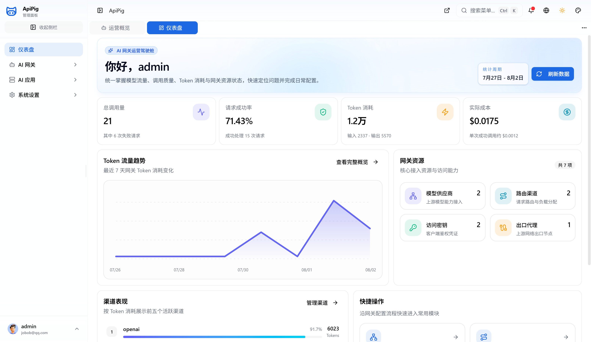
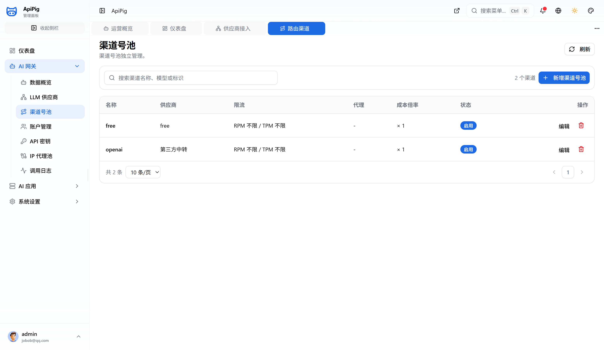
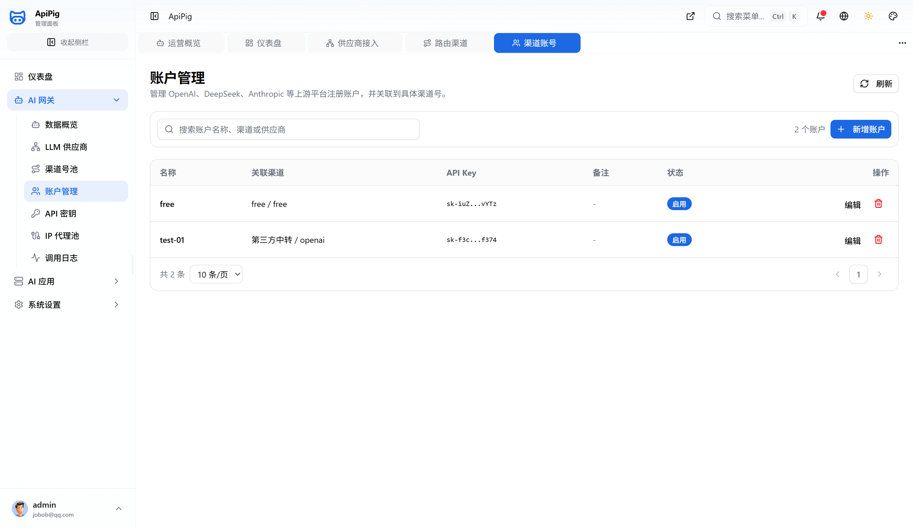
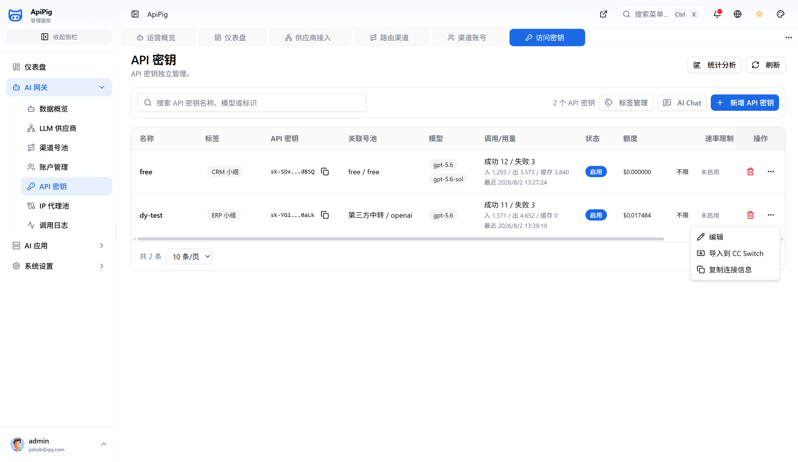
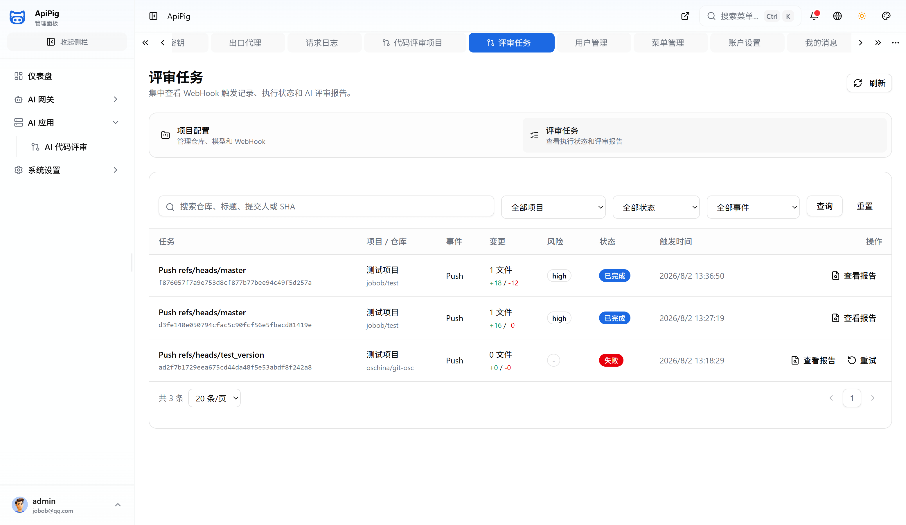
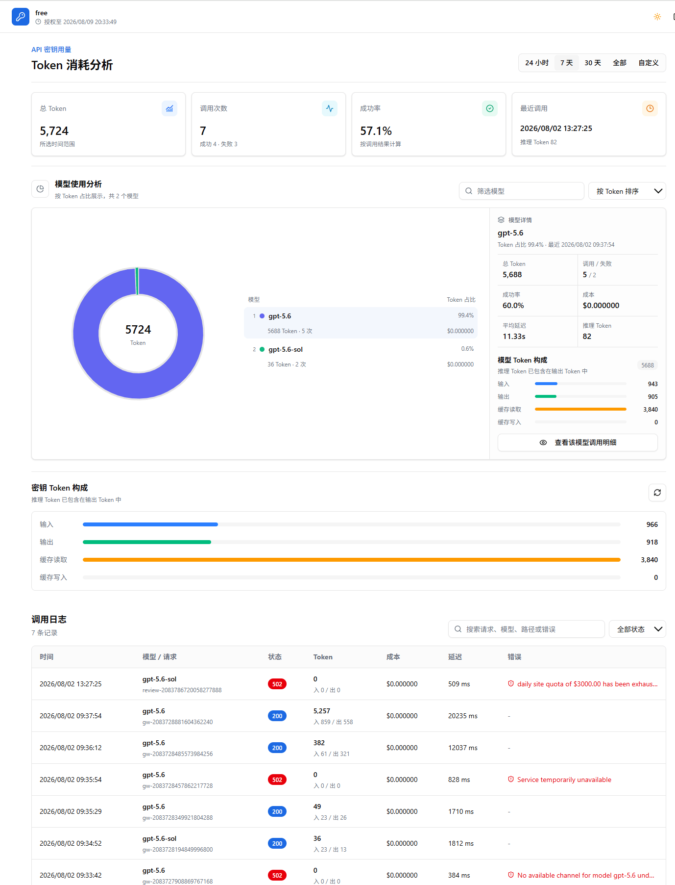

# apipig

free ai gateway 免费 ai 网关，企业级内部 AI 中转服务（ai中转站）。

> [APIPIG AI 网关 https://apipig.aizuda.com/](https://apipig.aizuda.com/)

> APIPIG 把多模型接入、账号池、API Key 托管、路由策略、权限控制和调用审计收进同一套 AI 网关与控制台。业务系统只对接一个入口，上游模型切换、渠道调整和安全治理都在平台侧完成。

- 统一 OpenAI 兼容协议入口
- 路由策略、权限校验、限流熔断
- 上游模型适配、通道切换、失败回退
- 请求日志、异常追踪、审计留痕

> ⭕本项目采用 `AGPL-3.0` 协议开源 `完全开放` 任何人可免费使用，必须遵守开源协议使用规范。

> 🔴附加协议：`不允许删除源码注释申明`，`不允许山寨换皮商用`，否则视为侵权`（索赔100万）`。

> 使用必须遵守国家法律法规，⛔不允许非法项目使用，后果自负❗

[企业版💎演示地址](https://aizuda.com)

> 打开官方开发文档 [国外](https://doc.flowlong.com)  [国内](https://flowlong.aizuda.com)

[点击设计器在线演示](https://flowlong-desginer.pages.dev)

[点击设计器源码下载](https://gitee.com/flowlong/flowlong-designer)

# 💎特别用户

<p>
  <a href="http://boot.aizuda.com/?from=flowlong" target="_blank">
   
  </a>
  <a href="http://apipig.aizuda.com/?from=flowlong" target="_blank">
   
  </a>
</p>

## 模型接入与协议统一
> OpenAI、Gemini、Qwen、DeepSeek、Ollama 等上游接口统一收口，业务只维护一个网关入口。

## 账号池与密钥托管
>集中管理 API Key、组织账号和渠道配置，让高风险凭证留在平台侧而不是散落到服务和脚本里。

## 权限策略与调用审计
> 对访问主体、模型权限、路由命中、异常响应和调用日志统一留痕，方便排障、归因和合规复核。

# 可视化功能界面

> 展示相关功能演示效果图

## 登录页


## 仪表盘



## 总览


## 供应商管理


## 渠道管理



## 渠道账号管理




## Token 管理



## 代码审查



## 菜单


## Token 用量统计


## API Token 登录页


## API Token 用量统计




## 打包发布

> 首次使用安装 `go install github.com/goreleaser/goreleaser@latest`

```shell
goreleaser release --snapshot --clean
```

无 Git tag 的 snapshot 版本从 `version/version.go` 的 `version.Default` 读取；正式版本仍以发布 tag 为准，二者通过同一份 GoReleaser 配置注入到两个二进制中。

发布正式版本时，先确保 tag 与 `version.Default` 一致，再创建对应的 Git tag（例如 `v1.2.3`），并执行 `goreleaser release --clean`。发布前校验会阻止 tag 与源码版本不一致的构建；通过后会从同一个 tag 和 commit 同时产出 `apipig` 与 `apipig-remote-agent`，并生成一份包含全部资产的校验文件。

- 打包无 cmd 窗口命令

`go build -ldflags "-s -w -H=windowsgui"`

## 首次运行初始化

- 当配置文件不存在或为空时，启动 `apipig.exe` 会在 `9527` 端口开启初始化服务，并自动打开 `web/init.html` 对应的初始化页面。
- 页面支持 SQLite、MySQL 和 PostgreSQL，可配置服务端口、数据库连接、管理员账号密码及 Swagger 等开关。
- 提交后程序会校验数据库连接、执行建表和基础数据初始化，自动生成缺失或为空的 `logger.json`，原子写入配置文件，然后自动切换到正式服务；已有非空日志配置不会被覆盖。
- 配置文件路径遵循 `-c` 参数、`CONFIG` 环境变量、默认 `config.yaml` 的优先级；已有非空配置不会被初始化流程覆盖。

## AI 协议网关

- 支持双协议接入

| 协议 | 端点 | 说明 |
|------|------|------|
| **OpenAI** | `POST /v1/chat/completions` | 聊天补全（流式/非流式） |
| | `POST /v1/embeddings` | 文本嵌入 |
| | `POST /v1/images/generations` | 图片生成 |
| | `POST /v1/rerank` | 重排 |
| | `POST /v1/audio/speech` | 语音合成 |
| | `POST /v1/audio/transcriptions` | 语音识别 |
| | `GET /v1/models` | 模型列表 |
| **Anthropic** | `POST /v1/messages` | Claude 消息（Claude Code 直接接入，流式事件转换） |

项目使用 `github.com/zendev-sh/goai v0.9.8` 作为统一大模型协议层，对外同时提供 OpenAI 与 Anthropic 兼容接口：

- `POST /v1/chat/completions`：OpenAI Chat Completions 协议，支持普通响应、SSE 流式响应、图片输入和工具调用。
- `POST /v1/embeddings`：OpenAI Embeddings 协议，支持文本或 Token 数组输入。
- `POST /v1/images/generations`：OpenAI Images Generations 协议，原样透传图片生成参数与响应。
- `POST /v1/rerank`：OpenAI 兼容生态常用的 Rerank 扩展协议，原样透传查询、文档和排序结果。
- `POST /v1/audio/speech`：OpenAI Audio Speech 协议，原样透传生成的音频内容与媒体类型。
- `POST /v1/audio/transcriptions`：OpenAI Audio Transcriptions 协议，支持 multipart 文件上传（文件最大 25 MiB）。
- `POST /v1/messages`：Anthropic Messages 协议，支持普通响应、SSE 流式响应、图片输入和工具调用。
- `GET /v1/models`：返回当前访问 Token 有权使用且存在启用渠道的模型。
- `GET /healthz`：应用与数据库存活检查，不需要网关 Token。

除健康检查外，上述协议接口使用 AI 网关访问 Token 鉴权，支持以下任一请求头：

```text
Authorization: Bearer sk-apipig-xxx
X-API-Key: sk-apipig-xxx
```

请求头名称不区分大小写，因此 Anthropic 等 SDK 使用的 `x-api-key` 写法同样支持。如果同时提供两个请求头，优先使用 `Authorization`。

当 `/v1/audio/transcriptions` 选中 `qwen` 或 `dashscope` 渠道时，网关会把 multipart 文件转换为 Qwen ASR 的 `chat/completions + input_audio` 请求，并将聊天结果还原为转写响应。支持标准 `language` 字段，以及可选的 `enable_itn` 和 JSON `asr_options` 扩展字段；Qwen 渠道的 `response_format` 支持 `json`、`text`。旧的 `chat/completions + input_audio` 调用方式继续保留。

供应商的 `protocol` 字段决定 GoAI 上游实现：

| protocol | 上游实现 | BaseURL 示例 |
| --- | --- | --- |
| `openai`、`codex` | OpenAI | `https://api.openai.com/v1` |
| `anthropic` | Anthropic | `https://api.anthropic.com` |
| `grok`、`xai` | xAI | `https://api.x.ai/v1` |
| `gemini`、`google` | Google Gemini | `https://generativelanguage.googleapis.com` |
| `qwen`、`dashscope` | OpenAI 兼容 | `https://dashscope.aliyuncs.com/compatible-mode/v1` |
| `custom`、其他值 | 通用 OpenAI 兼容 | 对应服务的 `/v1` 地址 |

模型调用仍复用现有供应商、渠道、访问 Token、代理、限流、熔断、额度和调用日志能力。RPM、TPM 和熔断状态使用本地内存原子计数，不依赖 Redis；多实例部署时各实例独立计数。渠道密钥从 `ap_ai_channel.api_key` 读取，模型列表使用英文逗号分隔。

## Git WebHook AI 代码评审

项目支持 GitHub、GitLab、Gitee 的 Push 与 Pull Request/Merge Request WebHook。系统完成验签、幂等去重、异步拉取、增量 Diff、AI 评审、任务恢复和报告持久化，并复用现有 AI 网关的模型授权、限流、熔断、计费与调用日志。配置与交互流程见 `docs/ai-applications/code-review-webhook.md`。

计费使用微美元整数账本，支持输入、输出、缓存读取、缓存写入、无 Token 固定价格和渠道成本倍率。调用日志保存倍率前标准成本、倍率快照及最终有效成本；Access Token 会累计成功/失败次数、细分 Token 用量、最后调用时间和有效成本。只有成功请求扣费，缓存读写默认分别按输入价格的 `0.1` 和 `1.25` 倍计价，也可以在供应商配置中显式覆盖。

访问 Token 创建或轮换后只返回一次明文，数据库仅保存哈希；管理端查询中的 Token、渠道 API Key 和代理密码均为脱敏值。渠道 API Key 和代理密码使用 AES-256-GCM 加密存储，生产环境应设置：

```text
APIPIG_AI_ENCRYPTION_KEY=<至少 32 字符的独立随机主密钥>
```

新建或轮换上游凭据必须配置该环境变量。旧明文凭据会在配置主密钥后读取时自动迁移；主密钥轮换需要完成数据迁移并重启应用。更完整的模块边界、安全策略和扩展方式见 `docs/ai-gateway-architecture.md`。


## 压缩执行包

> 下载 https://upx.github.io/ 添加到环境变量

- 例如，你可以使用 -9 参数进行最大压缩

```cmd
upx -9 apipig.exe
```
